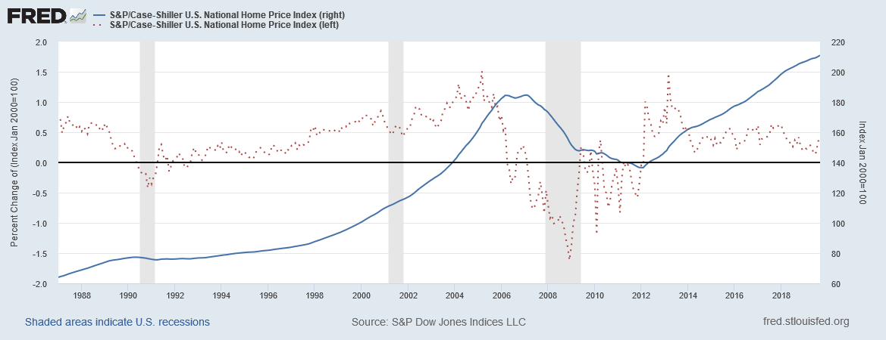

<!--
This is for including Chapter 1.  Notice that it's also good practice to name your chunk.  This will help you debug potential issues as you knit.  The chunk above is called intro and the one below is called chapter1.  Feel free to change the name of the Rmd file as you wish, but don't forget to change it here from chap1.Rmd.
-->

# An Unfurling Crisis {#actors-motive}

When 10 million Americans---1 of every 20 adults---lost their homes,[@martinForeclosedAmerica2015] it was clear that homeowners needed an intervention. When Countrywide, which two years earlier had serviced 20% of the mortgages in the United States,[@seabrooke2009politics] collapsed in July 2008, it was clear that the real estate industry needed to change.
When cities and counties around California, Florida, Nevada, and Arizona trembled at a declining tax base, it was clear that municipalities needed a break.
Yet, none of these actors wielded much power in the response to the subprime mortgage crisis.
Unlike the Great Depression, homeowners barely organized their political power and financial institutions imposed very modest debtor-relief programs.
Additionally, the long-term trend of municipal disinvestment emphasized the need to remove neighborhood blight instead of create or subsidize housing.

``` {r setup, include=FALSE}
library(knitr)
```

In reponse, the Housing and Economic Recovery Act of 2008 (HERA) authorized the Department of Housing and Urban Development (HUD) to distribute $3.9 billion to state and local governments for the purchase and repair of foreclosed properties.[@pelosiHousingEconomicRecovery2008]
This program, later termed the Neighborhood Stabilization Program (NSP), is my focus.
In purchasing, repairing, and in most cases reselling foreclosed properties, the NSP sought to mitigate the effects of foreclosures on their surroundings.
Primarily, foreclosures tear people from their homes.
On top of this comes the stigma of being a "deadbeat"[@dayenChainTitleHow2016] and mounds of fees---legal, cancellation, transportation-related.
But once homeowners have been forced out, the neighborhood and municipality bear the financial weight of that foreclosure.

To nearby homeowners, foreclosures cost $159,000 on average in decreased property values.[@immergluckPreventingNextMortgage2015]
To the city or county that envelops the property, it costs on average $64,000 for the legal and construction work to demolish and resell a vacant lot, parcels which tend to drop property values even further.
When property values drop, a home's [apparent] equity drops too.
This figure, estimated constantly by market research firms such as Zillow and appraised periodically by taxing authorities, determines to a large extent the wealth and borrowing power of homeowners.
If the value of an already-mortgaged home rises, homeowners can refinance.
While refinancing most often takes advantage of lower interest rates or decreased principal amounts to reduce monthly payments, refinancing was used by in the lead up to the subprime mortgage crisis instead to finance renovations, service debts (eg. student, credit card, and car loans), or cash out.
Lending institutions willingly converted apparent value into real value, and as long as home values crept up, refinancing was viable.
This use of refinancing reflected a shift in how Americans approached housing, from the home as an utterly private good, to the home as an asset.
Homes stand increasingly in the position of pension plans and 401ks; a wise move can transform forty years into four-hundred thousand dollars.

These wise moves seemd to occur constantly from September 1992 until March 2006.
As \@ref(fig:caseshiller) shows, the intervening 14 years never once saw a drop in the industry's standard home-price metric, the Case-Shiller U.S. National Home Price Index.
As prices rose, homeowners refinanced, effectively paying back the first mortgage while taking out the second.
To investors in mortgage-backed securities (MBS), pre-payment from refinancing is usually seen as a risk, but constant and predictable refinance added to the safety of securitization, playing into investors risk-reward calculus.
But when prices fell---or even flatlined---this safety evaporated.
Without the increased [apparent] home equity, refinancing did nothing.
Falling prices thus meant homeowners were saddled with their current mortgage, often one whose interest rates reset after two years, climbing an interest-rate staircase for the next 28 years.
Atop the interest payments, living expenses (such as other debts) piled on to borrowers, where previously refinancing had arrived to supplement existing income with cash.
Falling prices meant homeowners chose among food, water, and shelter, if they had enough income for that to even be a decision.

``` {r caseshiller, fig.cap = "Price (right axis) and growth (left axis) of the Case-Shiller Home Price Index, adjusted for seasonal price fluctuations.", echo = FALSE}

````

These factors make homeowners *very* sensitive to falling or stagnant home prices.
In their sensitivity, they may have voted for parties, candidates, and policies they believed would drive up home prices, such as property tax cuts, musucular code enforcement, and spacious zoning regulations.
Each of these policies reduces the resources available for non-homeowners, pitting homeowners against renters, the homeless, and anyone else without a direct financial stake in the asset.
For example, tax cuts, take they the form of directly-decreased property taxes or the homeowner tax credit, reduce the monies available to fund public goods.
In the United States, party ideology also ties higher taxes with explicitly redistributive policies, though Democrats and Republicans archetypically differ as to whether high taxes--more redistribution is good or bad.
The rigidity of these ideologies rationalizes the fear that rents extracted from higher taxation will not return to the homeowners.
Circling back to the original home-price dynamic, higher home values fund greater consumption, while lower property values and higher taxes (as they always have) limit homeowners' capacities to spend, an activity Americans very much enjoy.

When prices rose, creditor and debtor interests laid at some angle, intersecting in the particular case of safe, two-year refinancing, but divergent in the general case of refinancing that took advantage of lower interest rates.
On the other hand, falling housing prices conformed the immediate interests of creditors and debtors to one another, since delinquency and default eliminated any chance of extracting further rents.
Fears of a debt spiral triggered by falling home prices also beset cities(NEED REFERENCE) (though those fears appear to be ultimately unjustified[NEED REFERENCE FOR FED ARTICLE]).
With these interests in syzygy, why didn't homeowners, investors, or cities assert solutions, even ones that were done chiefly in their own interest?
I argue in this chapter first that homeowners remained quiet due to changes in the foreclosure process from the Great Depression, the differential character of housing versus farming, and narratives about mortgage debtors.
Second, the incongruity---spurred by the demise of savings and loans---between incentives for principals in mortgage-backed securities and agents tasked with servicing the underlying mortgages, along with fraudulent mortgage transfers, resulted in foreclosures that may have otherwise been unwanted by creditors.
Third, I point to municipal disinvestment and the trajectory of the Commerce Clause as reasons why cities were unable to handle mass foreclosures.
This critique I believe to be sufficient, though by no means necessary, to explaining why each was functionally barred from substantial action.

This argument functions triple purposes.
First, it justifes the motives of actors external to the creation of the Neighborhood Stabilization Program, to which internal actors, such as George W. Bush and members of Congress, responded.
Second, it offers a story about why external actors may not have acted decisively.
Third, this chapter buttresses the above theory of voting with more general insights from political economy literature.
Readers should come away from this chapter understanding why federal foreclosure relief programs were necessary and how the subprime mortgage crisis challenges previous theories of asset-based voting.

<!--What happened to homeowners and why they were unable to organize politically-->
## Why Homeowners were Unable to Organize {#homeowners}

Reasons for the powerlessness of anti-foreclosure organizing can be shown through comparison with the most successful anti-foreclosure campaigns of the Great Depression.
Legislative movements require a base of public opinion, a mouthpiece through which opinion can be articulated, and an audience to hear those articulated opinions and demands.
Organizing in response to the subprime mortgage crisis had its mouthpiece, but foreclosed housing's base of public opinion was small in proportion to other economic interests, and its audience usurped by mortgage servicers.
However, the Great Depression saw these factors come together in the Midwest, where farms were physically parched and thus, financially underwater.
Farmers were positioned similar to homeowners who adopted cash-out refinancing in that they reied on their land for its income.
However, farmers in the Great Depression differed from early 2000s subprime borrowers in that farming did not *supplement* wage income, it wholesale *replaced* wage incomes.
In addition, access to government and stark differences in media portrayal combined with the larger impact of farm foreclosures to drive organizing that led to 27 states enacting *per se* or *de facto* moratoria on foreclosures.[@wheelockChangingRulesState2008, 537]
The lack of such conditions pitched the struggle for foreclosure legislation in the subprime mortgage crisis to a severe angle.

First, farms are larger---physically and economically---than the homes that sit upon them.
This means farms play a more direct role in other peoples' business, and raises the stakes for passing foreclosure relief policies.

Second, farms determine to a great extent the activities of their residents.
Combined with the point above, this leads to more interactions among farmers, and thus, opportunities for further recruitment and homogenization of beliefs.

Third, crop failures occurred independent of government policy, but in conjunction with nearby farms.
This deepened the issues of particular areas.

Fourth, changes to foreclosure laws removed potential fora for resistance.


<!--Why banks were unable or unwilling to limit foreclosures-->
## Why Investors were Unable, and Banks Unwilling, to Limit Foreclosures {#banks}

The separation of investors from mortgage servicers constituted a separation of ownership from control.
Following the neoclassical literature, this separation led to perverse incentives: while investors lose money from foreclosures, the trustees of mortgage-backed securities gain money from foreclosures.
Securitization, an act of legal incorporation, severed the communicative link between investing and mortgage servicing.
When their interests were pitted against one another, the legal priority fell to the trustee, in whose interest it was to foreclose.
Before the separation of ownership from control in mortgages, a bank could decide---as many did in the Great Depression---not to foreclose in spite of its legal right.

<!--Why cities and states were unable to handle foreclosures-->
## Why Cities & States Could Not Handle Foreclosures {#cities-states}

The Commerce Clause was written, and did develop, with the express purpose of pre-empting states' right to economic legislation.

Municipal investment and debt dropped; these were indicators of municipal disinvestment. Cities and towns, for all their wants, did not possess the resources necessary to handle foreclosures.


## How This Configuration Feeds a National Mythos of Desert {#impact}

In the Great Depression, newspapers small and large fawned over the troubled farmer.
This treatment was not reserved for homebuyers in 2008.
Rather, they were termed "deadbeats", or, in CNBC reporter Rick Santelli's terms, "losers".
The stigma surrounding foreclosed-upon borrowers was twofold: on one hand, they were labeled with the technical (and thus depoliticized) term "subprime"; on the other, they were denounced as irresponsible for multiple mortgages and refinancings.
These labels came in spite of the fact that most foreclosures occurred to prime mortgages, not subprime, and that repeated borrowing against leverage increases as a trend among U.S. companies.
The difference lies in that businesses, such as farms, supposedly repay debts by increasing use value, where in the housing bubble, debts were repaid by pure increases in exchange value.
These narratives furthered the idea of the foreclosed-upon borrower as deserving of their fate.
In discouraging sympathy from non-delinquent homeowners to delinquent homeowners, these narratives cleave political interests along the propertied/un-propertied distinction rather than the housed/un-housed line.
This supports asset-based theories of voting, which explain voting as a rational choice logic operating on wealth rather than income.
